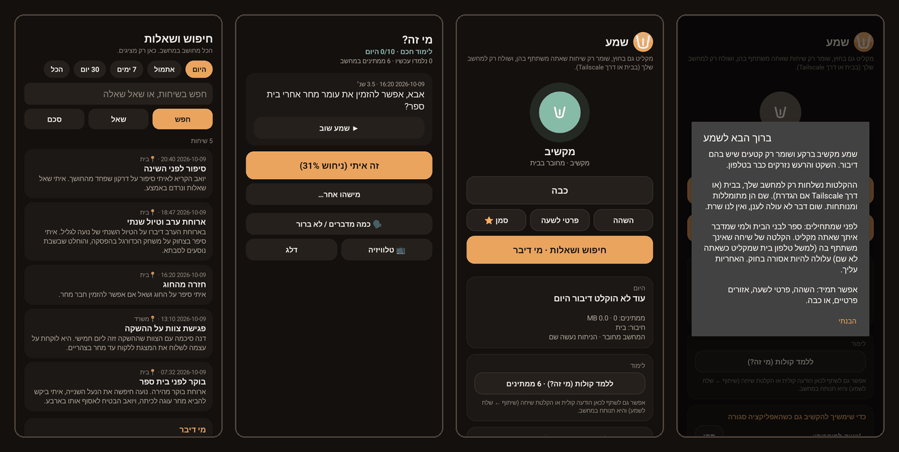
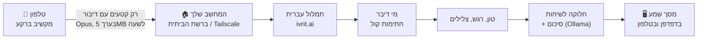
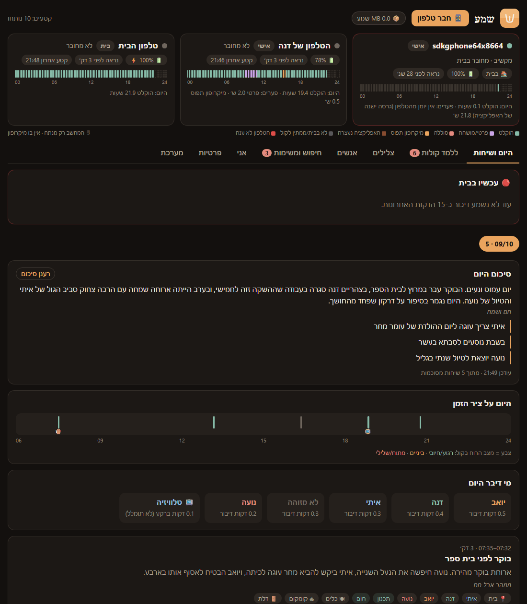
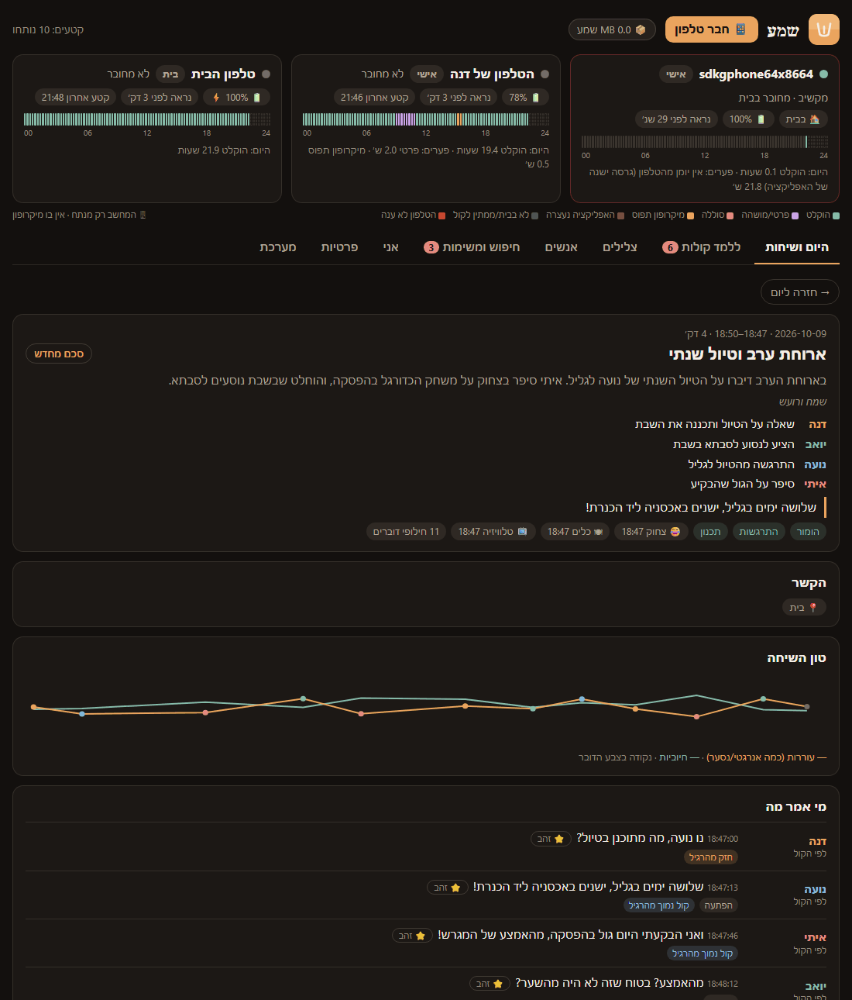
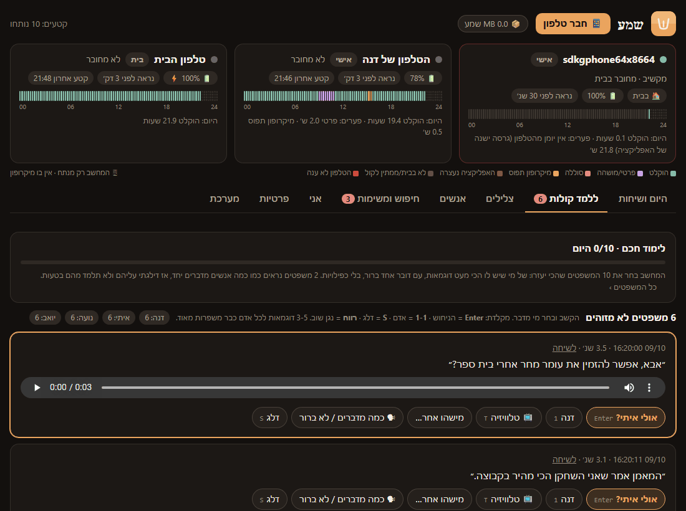
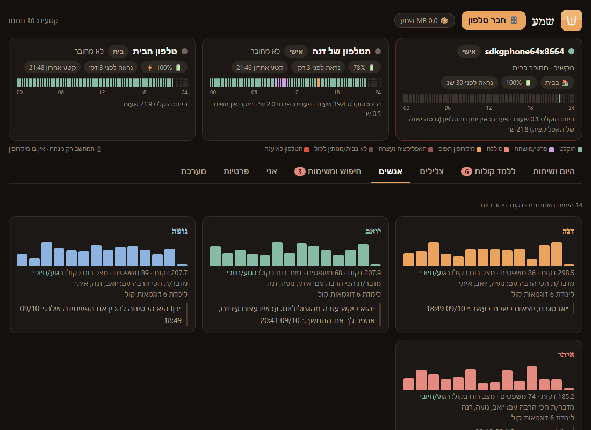
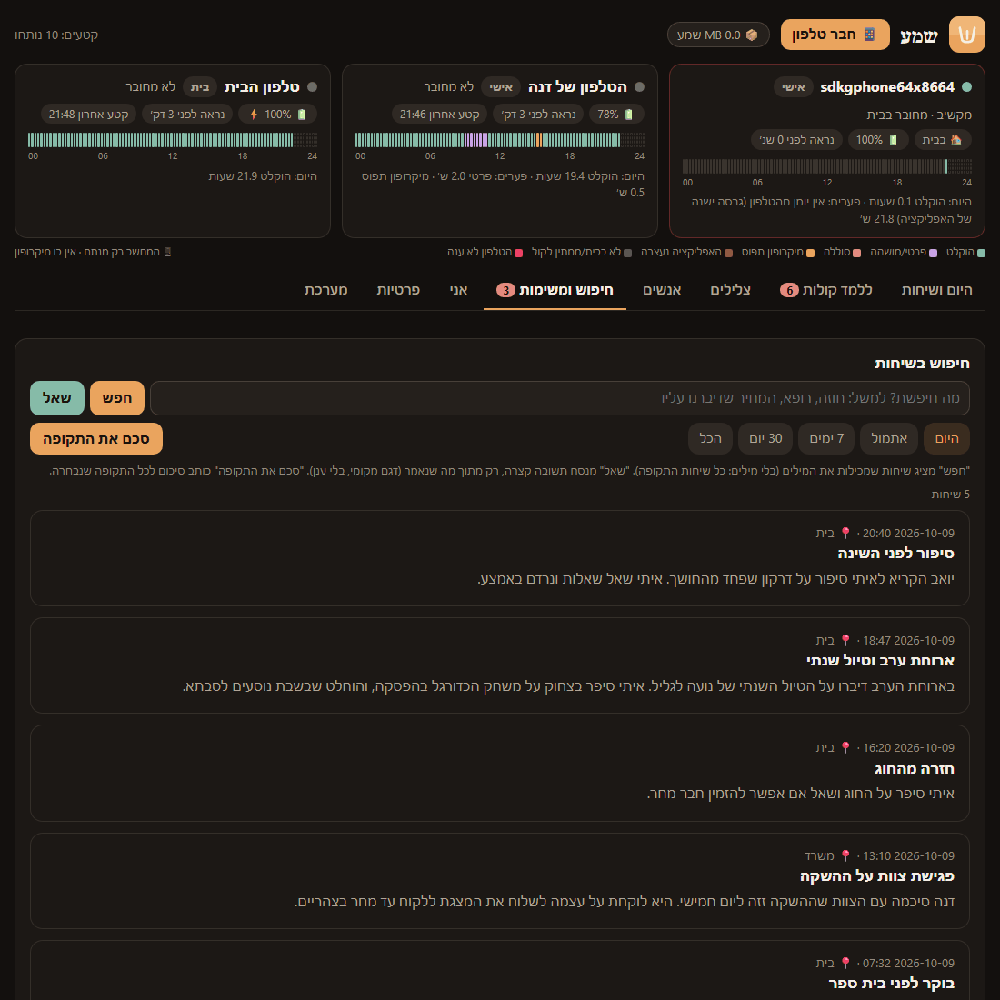
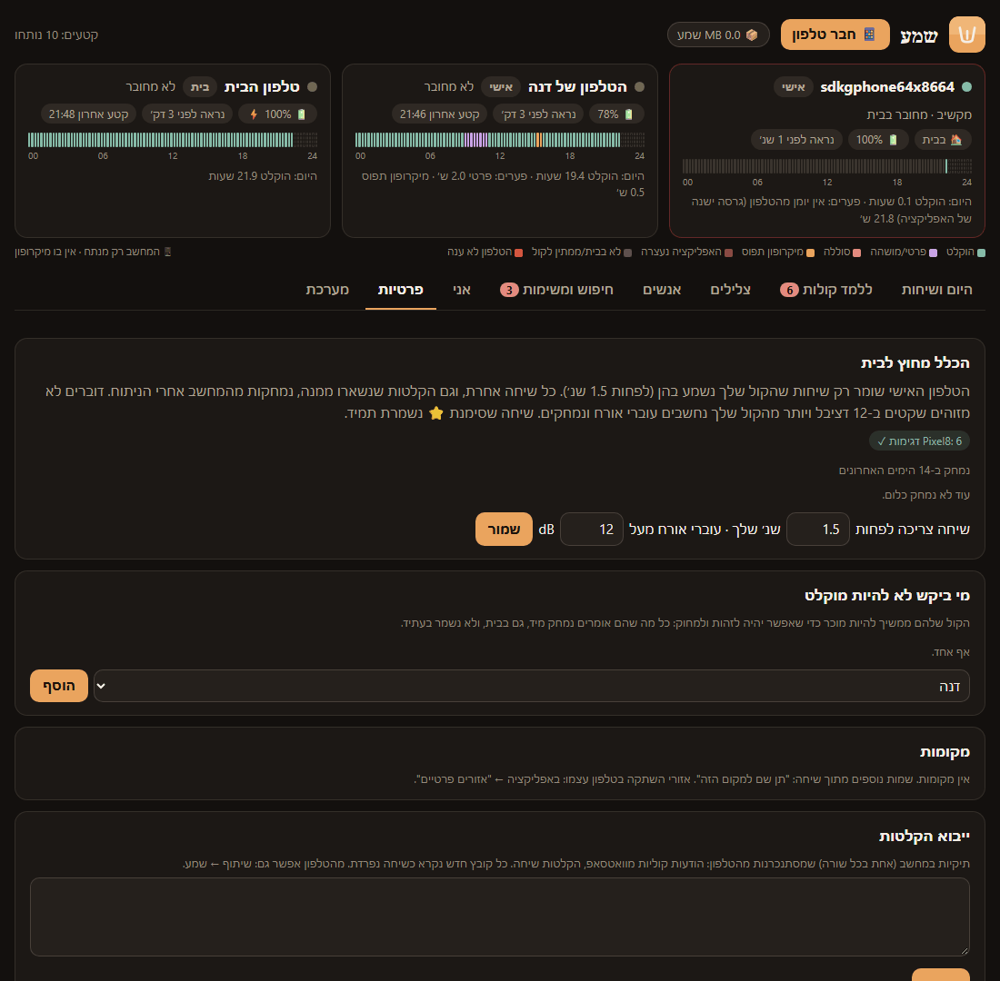
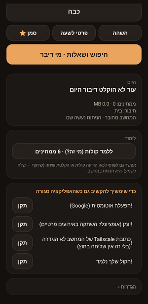
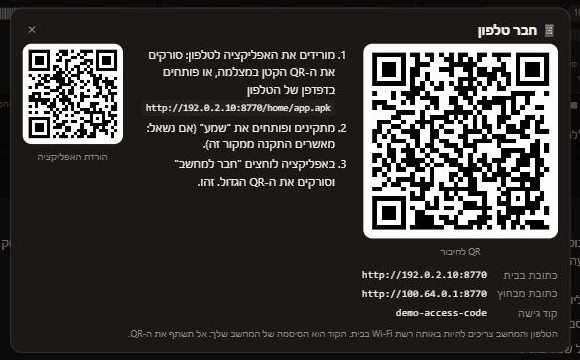

<div dir="rtl">

<p align="center">
  
</p>

<h1 align="center">שמע</h1>

<p align="center">
  <b>הקלטה, תמלול עברית וסיכום של מה שנאמר סביבך, מקומית לגמרי.</b><br>
  אפליקציית אנדרואיד שמקשיבה + מחשב Windows שמתמלל ומנתח. בלי ענן, בלי חשבון, בלי מנוי.
</p>

<p align="center">
  <a href="../../releases/latest"><b>⬇ הורדה (הגרסה האחרונה)</b></a> ·
  <a href="#התקנה-ב-4-צעדים">התקנה</a> ·
  <a href="#סיור-במסכים">סיור במסכים</a> ·
  <a href="#פרטיות">פרטיות</a> ·
  <a href="#הקלטה-וחוק">הקלטה וחוק</a>
</p>

<p align="center">
  
</p>

> כל צילומי המסך בעמוד הזה מראים **משפחה מומצאת** (דנה, יואב, נועה ואיתי) ונתוני הדגמה.

## מה זה נותן לך

- **זיכרון של היום.** מה אמרו בארוחת הבוקר, מה סיכמת בפגישה, מה הילד סיפר כשחזר מהחוג. הכל מתומלל, מחולק לשיחות ומסוכם.
- **מי אמר מה.** שמע לומד את הקולות של האנשים הקרובים אליך (אתה מלמד אותו בכמה לחיצות), ומאז מזהה אותם לבד.
- **סיכומים ומשימות.** לכל שיחה כותרת וסיכום קצר, וסיכום יומי. התחייבויות שנאמרו ("אני אשלח עד מחר") נאספות לרשימת משימות, עם הציטוט.
- **חיפוש ושאלות.** "מה אמרנו על הטיול?", "מתי דיברנו עם הרופא?" ותשובה מתוך השיחות עצמן.
- **טון ואווירה.** מתי היה רגוע, מתי היה מתוח, מי דיבר הכי הרבה, מה נשמע ברקע (צחוק, טלוויזיה, דלת, כלים...).
- **פרטיות בתכנון.** ההקלטות לא יוצאות מהבית. אין שרת של שמע. כפתור "פרטי לשעה", אזורים פרטיים, ומחיקה אוטומטית של שיחות בחוץ שאתה לא חלק מהן.

## איך זה עובד



1. **בטלפון** רץ זיהוי דיבור קטן (Silero VAD). שקט, רעש ומוזיקה בלי דיבור נזרקים מיד, וקטעי דיבור נשמרים בפורמט קטן (Opus 12kbps).
2. הקטעים נשלחים **רק למחשב שלך**: בבית דרך ה-Wi-Fi, ומבחוץ דרך Tailscale (אם הגדרת). כשהמחשב לא זמין הם מחכים בטלפון ונשלחים אחר כך, לפי הסדר.
3. **במחשב** כל קטע עובר:
   - **תמלול עברית** במודל של [ivrit.ai](https://huggingface.co/ivrit-ai) (Whisper large-v3 turbo שאומן על עברית).
   - **זיהוי דוברים** לפי חתימת קול, מול הקולות שלימדת.
   - **טון ורגש** מהקול (גובה, עוצמה, קצב, עוררות, חיוביות), ו**צלילים** ברקע.
   - **סינון טלוויזיה ושירים:** דיבור מהטלוויזיה מסומן כ"ברקע" ולא נכנס לתמלול.
4. קטעים קרובים בזמן מתחברים ל**שיחה**. כשהשיחה נגמרת, מודל שפה מקומי (Gemma דרך Ollama) כותב לה כותרת, סיכום, אווירה ומשימות. בסוף היום נכתב סיכום יומי.
5. את הכל רואים ב**מסך של שמע**, בדפדפן במחשב (`http://localhost:8770/home`) או באפליקציה בטלפון.

## סיור במסכים

### היום ושיחות
המסך הראשי. למעלה כרטיס לכל טלפון: האם הוא מחובר, סוללה, ו**פס כיסוי** של 24 שעות שמראה מתי הקליט ומתי לא, ולמה (פרטי, סוללה, מיקרופון תפוס...). מתחת: סיכום היום, ציר זמן צבוע לפי מצב הרוח, מי דיבר כמה, ורשימת השיחות של היום.

<p align="center"></p>

### שיחה אחת
לכל שיחה: כותרת, סיכום, מה כל אחד אמר או רצה, תגיות (הומור, תכנון, התרגשות...) וצלילים ברקע. גרף **טון השיחה** מראה איך העוררות והחיוביות השתנו לאורך השיחה. מתחת יש את **התמלול המלא** עם שם הדובר, השעה והרגש. משפט שזוהה לא נכון אפשר לתקן בלחיצה, ואפשר להאזין לו כל עוד השמע שמור.

<p align="center"></p>

### ללמד קולות
ככה שמע לומד מי זה מי. הוא בוחר כל יום **עד 10 משפטים** שהכי כדאי לשאול עליהם: מאנשים שיש להם מעט דוגמאות, עם קול אחד ברור, בלי כפילויות. שומעים את המשפט ולוחצים על השם. אפשר גם בקיצורי מקלדת. אחרי 3 עד 5 דוגמאות לכל אדם הזיהוי נעשה לבד, וכל משפט שלימדת מתקן אוטומטית גם משפטים דומים מ-30 הימים האחרונים. אותו דבר זמין גם בטלפון ("מי זה?").

<p align="center"></p>

### אנשים
לכל אדם: כמה דקות דיבר בכל אחד מ-14 הימים האחרונים, מצב הרוח הממוצע בקול, עם מי הוא מדבר הכי הרבה, כמה דוגמאות קול לימדת, ומה המשפט האחרון שלו.

<p align="center"></p>

### חיפוש ומשימות
- **חפש:** מוצא שיחות לפי מילים, גם עם תחיליות ("בטיול", "לטיול"), בתקופה שבוחרים (היום, אתמול, 7 ימים, 30 יום, הכל).
- **שאל:** כותב תשובה קצרה רק מתוך מה שנאמר, ומראה את השיחות שעליהן היא מבוססת.
- **סכם את התקופה:** סיכום של שבוע או חודש.
- **משימות והתחייבויות:** כל מה שמישהו התחייב לעשות, עם ציטוט ושעה. מסמנים "בוצע" או "לא רלוונטי".

<p align="center"></p>

### פרטיות
כאן קובעים את הכללים: כמה מהקול שלך צריך להישמע כדי ששיחה בחוץ תישמר, מי ביקש לא להיות מוקלט (כל מה שהוא אומר נמחק מיד, גם בעתיד), מקומות פרטיים, ותיקיות לייבוא הקלטות (הודעות קוליות, הקלטות שיחה).

<p align="center"></p>

### עוד בלשוניות
- **צלילים:** מה נשמע בבית במשך היום (צחוק, בכי, דלת, מיקרוגל, כלב...). צליל שלא זוהה אפשר לשמוע ולתת לו שם ("הפעמון שלנו"), ומאז שמע יזהה אותו.
- **אני:** הדיבור שלך: כמה דיברת, קצב, מילות מילוי, כמה קטעת וכמה קטעו אותך. זה כלי לתצפית עצמית, לא ציון.
- **מערכת:** תקינות (קטעים שנכשלו ולמה), אחסון והערכה לשנה, ומודל התמלול. פעם ב-90 יום שמע בודק אם ל-ivrit.ai יש מודל חדש, ועובר אליו רק אם הוא טוב ב-10% לפחות על המשפטים שלך.
- **📦 מקום בדיסק:** כמה מקום ההקלטות תופסות, ומחיקה של הקלטות ישנות לפי תאריך (התמלול נשאר).

### האפליקציה בטלפון

| כפתור | מה הוא עושה |
|---|---|
| **התחל להקשיב / כבה** | מפעיל או עוצר את ההקשבה. כשהיא פועלת יש התראה קבועה, כך שתמיד רואים שהטלפון מקליט. |
| **השהה** | עוצר עד שלוחצים "המשך". |
| **פרטי לשעה** | שעה בלי הקלטה בכלל. יש גם אריח בהגדרות המהירות. |
| **סמן ⭐** | שומר את הרגע: 10 דקות לפני ואחרי לא יימחקו לעולם. לחיצה ארוכה: עד שעתיים. |
| **חיפוש ושאלות · מי דיבר** | השיחות, הסיכומים והחיפוש, מהטלפון. |
| **ללמד קולות** | "מי זה?" עם האזנה למשפט. |
| **ללמד את הקול שלי** | 25 שניות של קריאה בקול. בלי זה הטלפון האישי לא מקליט מחוץ לבית. |
| **אזורים פרטיים ויומן** | מקומות בלי הקלטה (רופא, עבודה...), ומילים ביומן שמשתיקות את ההקלטה בזמן הפגישה. |



**רשימת "מה חסר"** במסך הראשי מראה רק את מה שעוד לא מוגדר, וליד כל שורה יש כפתור "תקן" שפותח את המסך הנכון: מיקרופון, התראות, סוללה ללא הגבלה, מיקום (כדי לזהות את רשת הבית), הפעלה אוטומטית אצל יצרנים שהורגים אפליקציות ברקע, Tailscale, ולימוד הקול שלך.

**שני תפקידים לטלפון** (הגדרות ← תפקיד הטלפון):
- **טלפון אישי** (ברירת המחדל) הולך איתך ומקליט גם בחוץ, אבל רק אחרי שלמד את הקול שלך. המחשב שומר מבחוץ רק שיחות שאתה משתתף בהן, ומוחק קולות רחוקים של עוברי אורח.
- **טלפון בית** נשאר בבית (למשל טלפון ישן על המדף) ומקליט רק כשהוא ברשת הבית.

אפשר גם **לשתף** לשמע הודעה קולית או הקלטת שיחה מכל אפליקציה (שיתוף ← שלח לשמע), והיא תנותח במחשב כשיחה נפרדת.

<br clear="left">

## דרישות

| | מינימום | מומלץ |
|---|---|---|
| **מחשב** | Windows 10/11 ‏64 ביט, ‏15GB פנויים, דלוק רוב היום | כרטיס **NVIDIA עם 8GB ומעלה** (12GB ומעלה למודל הסיכומים הגדול) |
| **טלפון** | אנדרואיד 10 ומעלה (64 ביט) | טלפון שלא סוגר אפליקציות ברקע באגרסיביות |
| **רשת** | הטלפון והמחשב באותה רשת Wi-Fi | Tailscale כדי לשלוח גם מבחוץ |

בלי NVIDIA הכל עובד על המעבד, אבל התמלול איטי יותר: ההקלטות מחכות בתור ומתעדכנות לאורך היום ולא מיד.

**מה המתקין בוחר לבד:**

| המחשב | תמלול | סיכומים |
|---|---|---|
| NVIDIA עם 12GB ומעלה | ivrit.ai turbo על כרטיס המסך | gemma3:12b |
| NVIDIA עם 8 עד 12GB | ivrit.ai turbo על כרטיס המסך | gemma3:4b |
| בלי NVIDIA, או פחות מ-8GB | אותו מודל על המעבד (int8) | gemma3:4b |

## התקנה ב-4 צעדים

1. **הורדה:** בעמוד [Releases](../../releases/latest) מורידים את `shema-windows-vX.Y.Z.zip` ופותחים אותו (קליק ימני ← חלץ הכל).
2. **מחשב:** בתיקייה שנפתחה נכנסים ל-`install` ולוחצים פעמיים על **`Install.bat`**. המתקין בודק את המחשב, מתקין את מה שחסר (Python, ffmpeg, Ollama והמודלים: כמה GB בפעם הראשונה, ולכן זה לוקח זמן), שואל איך קוראים לך, ופותח את המסך של שמע. בסוף Windows ישאל פעם אחת אם לאשר שינוי: זה פותח את הפורט לטלפון, רק ברשת הביתית.
3. **טלפון:** במסך של שמע במחשב לוחצים **📱 חבר טלפון**. סורקים במצלמה של הטלפון את ה-QR הקטן כדי להוריד את האפליקציה, מתקינים (אם נשאל: מאשרים התקנה ממקור זה), פותחים, לוחצים **"חבר למחשב"** וסורקים את ה-QR הגדול. האפליקציה תבקש הרשאות, וכדאי לאשר הכל.
4. **לימוד קול:** באפליקציה לוחצים **"ללמד את הקול שלי"** וקוראים בקול 25 שניות. אחר כך, בלשונית **"ללמד קולות"**, עונים על כמה שאלות "מי זה?" על בני הבית.

<p align="center"></p>

את המסך פותחים מהסמל **"שמע"** בשולחן העבודה. השרת עולה לבד בכל כניסה ל-Windows, ברקע ובלי חלון.

**מה המתקין עושה, בפירוט:** בודק את גרסת Windows, המקום הפנוי, כרטיס המסך ו-Smart App Control. מתקין Python 3.11, ffmpeg ו-Ollama דרך winget. יוצר סביבת Python פרטית והמודלים ב-`%LOCALAPPDATA%\Shema`, יוצר קוד גישה אקראי, ומוסיף כלל חומת אש לפורט 8770 ברשת פרטית בלבד. בנוסף הוא מגדיר משימה מתוזמנת שמפעילה את השרת בכניסה ל-Windows, יוצר את הסמל "שמע" ומוריד את האפליקציה העדכנית לטלפון. אפשר להריץ אותו שוב בכל זמן: הוא מעדכן ולא שובר. **הוא לא מכבה שום הגנה של Windows.**

## הקלטה גם מחוץ לבית (Tailscale)

בלי הגדרה נוספת, מה שמוקלט בחוץ נשמר בטלפון ונשלח כשחוזרים הביתה. כדי שיישלח גם מבחוץ:

1. מתקינים [Tailscale](https://tailscale.com/download) (חינם) במחשב ובטלפון ומתחברים לאותו חשבון.
2. מריצים שוב את `Install.bat`. הוא מזהה את Tailscale, מוסיף כלל חומת אש רק לכתובות של Tailscale ‏(100.64.0.0/10) ומכניס את הכתובת ל-QR.
3. בטלפון: "חבר למחשב" וסריקה מחדש.

התעבורה עוברת ישירות בין המכשירים שלך, מוצפנת.

## פרטיות

- **הכל מקומי.** ההקלטות, התמלולים, הסיכומים וחתימות הקול נשמרים רק במחשב שלך, ב-`%LOCALAPPDATA%\Shema\data`. הסיכומים נכתבים על ידי מודל שרץ במחשב. אין שרת של שמע, ושום דבר לא עולה לענן.
- **מה כן יוצא לאינטרנט:** רק הורדות: התוכנות והמודלים, בזמן ההתקנה ובשימוש הראשון (GitHub, Hugging Face, PyTorch, Ollama, winget). פעם ב-90 יום השרת בודק ב-Hugging Face אם יש מודל תמלול עברי חדש. זיהוי שירים (Shazam) **כבוי** כברירת מחדל.
- **הטלפון שולח רק למחשב שלך**, לכתובת שבקוד ה-QR, ולפני השמירה הוא מראה לך אותה. קוד הגישה נוצר אקראית בהתקנה. המסך במחשב פתוח רק למחשב עצמו ולמכשירים שיש להם את הקוד.
- **מה נשמר:** כברירת מחדל נשמר ארכיון קטן של הדיבור (Opus 12kbps, בערך 5MB לשעת דיבור), כדי שאפשר יהיה לשמוע וללמד. שמע של צלילים ושל לימוד קול נמחק. מספרים ארוכים (כרטיס אשראי, ת"ז, טלפון) מוסתרים בתמלול. אפשר למחוק הקלטות לפי תאריך מהמסך (📦).
- **מי שלא רוצה להיות מוקלט:** במסך "פרטיות" מסמנים אותו, וכל מה שהוא אומר נמחק מיד, גם בעתיד.

## הקלטה וחוק

> זה לא ייעוץ משפטי.

בישראל, לפי **חוק האזנת סתר**, מי שמשתתף בשיחה רשאי בדרך כלל להקליט אותה. **הקלטה של שיחה שאתה לא צד לה** (למשל "טלפון בית" שמקליט כשאתה לא בבית, או שיחה של אחרים בחדר אחר) **עלולה להיות עבירה.**

לכן:
- **ספר לבני הבית** ולמי שמדבר איתך באופן קבוע שאתה משתמש בשמע. עדיף לקבל הסכמה.
- הטלפון האישי מתוכנן לשמור בחוץ רק שיחות שהקול שלך נשמע בהן. זה עוזר, אבל זה לא תחליף לשיקול דעת.
- במקומות רגישים (רופא, עבודה, מקומות של אחרים) השתמש ב"פרטי לשעה" או באזורים פרטיים.
- **האחריות על השימוש היא שלך בלבד.** בחו"ל החוק שונה, ובמקומות רבים נדרשת הסכמה של כל המשתתפים.

## שאלות נפוצות

**כמה סוללה זה לוקח?** זיהוי הדיבור בטלפון קל, והטלפון שולח קבצים קטנים בקבוצות, אבל זו עדיין אפליקציה שמקשיבה כל הזמן, וזה מורגש. מתחת ל-15% סוללה (כשלא בטעינה) השליחה מחכה, ומתחת ל-8% ההקלטה נעצרת.

**כמה מקום זה תופס?** בערך 5MB לשעת דיבור, כלומר כמה GB בשנה למשפחה פעילה. המסך מראה הערכה לשנה ואת המקום הפנוי בדיסק.

**מה אם המחשב כבוי?** הטלפון ממשיך להקליט ושומר בצד (עד בערך 1.5GB). כשהמחשב חוזר הכל נשלח ומתומלל לפי הסדר.

**כמה מדויק התמלול?** בעברית מדוברת זה טוב מאוד כשהטלפון קרוב, ופחות טוב ברעש או ממרחק. אפשר לתקן משפט ולהוסיף אותו ל"סט זהב" (⭐ ליד משפט בשיחה), ושמע משתמש בסט הזה כדי לבחור מודל טוב יותר כשיוצא אחד.

**זה עובד באייפון?** לא. iOS לא מאפשר לאפליקציה להקשיב ברקע כל הזמן.

**זה עובד על Mac או Linux?** צד המחשב כתוב ב-Python ויכול לרוץ שם, אבל המתקין הוא ל-Windows בלבד.

## פתרון בעיות

**Smart App Control / "An Application Control policy has blocked this file"**
ב-Windows 11 חדשים פועלת לפעמים הגנה בשם Smart App Control, שחוסמת קבצים בלי חתימה מוכרת, כולל חלק מספריות Python. המתקין בודק את זה, **לא מכבה אותה**, ובסוף מדווח בדיוק מה נחסם. האפשרויות: להתקין את צד המחשב על מחשב אחר, או לכבות את Smart App Control בעצמך (אבטחת Windows ← בקרת אפליקציות ודפדפן). שים לב: אחרי כיבוי אי אפשר להפעיל אותה שוב בלי להתקין את Windows מחדש. ההחלטה שלך.

**Windows מזהיר כשפותחים את Install.bat**
קבצים שהורדו מהאינטרנט מסומנים. אפשר לבדוק את הקוד כאן בריפו, ואז "מידע נוסף" ← "הפעל בכל זאת", או קליק ימני על ה-ZIP לפני החילוץ ← מאפיינים ← "בטל חסימה".

**הטלפון הורג את האפליקציה ברקע (Xiaomi/MIUI/HyperOS, OPPO/realme/OnePlus/ColorOS, Samsung, vivo)**
ברשימת "מה חסר" באפליקציה יש כפתורים שפותחים את המסך הנכון:
- **סוללה:** ללא הגבלות.
- **הפעלה אוטומטית** (Xiaomi, ColorOS, vivo): להפעיל לשמע.
- **ColorOS:** "פעילות ברקע ללא הגבלה", ובמסך האפליקציות האחרונות לנעול את הכרטיס של שמע (מנעול).
- **MIUI/HyperOS:** "חיסכון בסוללה" ← ללא הגבלות, ו"הפעלה אוטומטית".

פס הכיסוי בכרטיס הטלפון במסך המחשב מראה בדיוק מתי הטלפון לא הקליט, ולמה.

**הטלפון לא מתחבר**
- הטלפון והמחשב באותה רשת Wi-Fi? (לא רשת אורחים)
- ב-Windows הרשת מוגדרת "ציבורית"? המתקין מתריע על זה. צריך לשנות ל"פרטית": הגדרות ← רשת ואינטרנט ← Wi-Fi ← מאפיינים.
- המחשב דלוק והשרת רץ? פתח את הסמל "שמע" במחשב. אם המסך לא נפתח, הרץ שוב את `Install.bat`.
- המחשב קיבל כתובת חדשה מהראוטר? סרוק שוב את ה-QR.
- יומן השרת נמצא ב-`%LOCALAPPDATA%\Shema\data\listener.log`.

**התמלול איטי**
בלי NVIDIA (או עם פחות מ-8GB) התמלול רץ על המעבד, וזה צפוי. ההקלטות לא הולכות לאיבוד: הן מחכות בתור ומתומללות לפי הסדר. את התור רואים בלשונית "מערכת".

**אין סיכומים לשיחות**
הסיכומים צריכים את Ollama ואת המודל. הרץ שוב את `Install.bat`, והוא ישלים את מה שחסר.

## עדכון

מורידים את ה-ZIP החדש מ-[Releases](../../releases/latest) ומריצים שוב את `Install.bat`. הנתונים, הקולות שלימדת וקוד הגישה נשארים. המתקין גם מוריד את האפליקציה העדכנית לטלפון. כדי לעדכן את הטלפון פותחים בו שוב את הקישור מ"📱 חבר טלפון", וההתקנה מעל הגרסה הקיימת שומרת את ההגדרות.

## הסרה

- **מחשב:** `%LOCALAPPDATA%\Shema\Uninstall.bat` (או `install\Uninstall.bat` מה-ZIP). מסיר את המשימה ברקע, את כללי חומת האש, את סביבת ה-Python, את המודלים ואת הסמלים. **שואל לפני** שהוא מוחק את ההקלטות והנתונים. Python, ffmpeg, Ollama ו-Tailscale נשארים, ואפשר להסיר אותם בהגדרות ← אפליקציות.
- **טלפון:** לחיצה ארוכה על הסמל של שמע ← הסר התקנה. מה שעוד לא נשלח נמחק איתו.

## רכיבי צד שלישי

הקוד של שמע הוא תחת רישיון MIT (קובץ `LICENSE`). **המודלים לא נמצאים בריפו**: הם יורדים בזמן ההתקנה או בשימוש הראשון, וכל אחד נשאר תחת הרישיון שלו.

| רכיב | תפקיד | איפה | רישיון |
|---|---|---|---|
| [Silero VAD](https://github.com/snakers4/silero-vad) | זיהוי דיבור | בתוך ה-APK, ומורד למחשב | MIT |
| [ONNX Runtime](https://github.com/microsoft/onnxruntime) | הרצת Silero בטלפון | בתוך ה-APK | MIT |
| [ZXing Android Embedded](https://github.com/journeyapps/zxing-android-embedded) + ZXing | סריקת QR | בתוך ה-APK | Apache-2.0 |
| AndroidX Core | ספריית אנדרואיד | בתוך ה-APK | Apache-2.0 |
| [qrcode-generator](https://github.com/kazuhikoarase/qrcode-generator) | ציור ה-QR במסך | `server/ui/qrcode.js` | MIT |
| [ivrit-ai/whisper-large-v3-turbo-ct2](https://huggingface.co/ivrit-ai/whisper-large-v3-turbo-ct2) | תמלול עברית | מורד | Apache-2.0 |
| [faster-whisper](https://github.com/SYSTRAN/faster-whisper), CTranslate2 | הרצת התמלול | pip | MIT |
| [sherpa-onnx](https://github.com/k2-fsa/sherpa-onnx) | קולות וצלילים | pip | Apache-2.0 |
| [3D-Speaker ERes2NetV2](https://github.com/modelscope/3D-Speaker) | חתימת קול | מורד | Apache-2.0 |
| [NVIDIA TitaNet-Large](https://huggingface.co/nvidia/speakerverification_en_titanet_large) | חתימת קול | מורד | CC-BY-4.0 |
| [CED-base](https://huggingface.co/mispeech/ced-base) (גרסת sherpa-onnx) | זיהוי צלילים | מורד | Apache-2.0 |
| [emotion2vec+ large](https://huggingface.co/emotion2vec/emotion2vec_plus_large) | רגש מהקול | מורד | FunASR Model License 1.1 (שימוש חופשי בתנאי ייחוס) |
| [FunASR](https://github.com/modelscope/FunASR) | הרצת emotion2vec | pip | MIT |
| [audeering wav2vec2 MSP-dim](https://huggingface.co/audeering/wav2vec2-large-robust-12-ft-emotion-msp-dim) | עוררות וחיוביות בקול | מורד | **CC-BY-NC-SA-4.0: לשימוש לא מסחרי בלבד** |
| [LAION CLAP larger_clap_general](https://huggingface.co/laion/larger_clap_general) | צלילים שאתה מלמד (רק עם NVIDIA) | מורד | Apache-2.0 |
| [Demucs htdemucs](https://github.com/facebookresearch/demucs) | הפרדת דיבור ממוזיקה | pip + מורד | MIT |
| [Praat / parselmouth](https://github.com/YannickJadoul/Parselmouth) | גובה ועוצמת קול | pip | GPL-3.0 |
| PyTorch, transformers, librosa, huggingface_hub | תשתית | pip | BSD-3 / Apache-2.0 / ISC / Apache-2.0 |
| [Ollama](https://ollama.com) | הרצת מודל הסיכומים | winget | MIT |
| [Gemma 3](https://ai.google.dev/gemma/terms) (4b או 12b) | סיכומים | `ollama pull` | Gemma Terms of Use |
| [FFmpeg](https://ffmpeg.org) (build של Gyan) | המרת שמע | winget | GPL-3.0 |
| [shazamio](https://github.com/shazamio/ShazamIO) | זיהוי שירים, **אופציונלי וכבוי** | לא מותקן | MIT |

בגלל המודל של audeering, השימוש בשמע כמו שהוא מתאים **לשימוש אישי ולא מסחרי**.

## לפיתוח

```
android/   אפליקציית אנדרואיד (Kotlin, בלי קבצי layout). בנייה: android\gradlew.bat assembleRelease
server/    השרת (Python): home_listener.py (HTTP + תור + שיחות + סיכומים), home_analyze.py (תמלול, דוברים, טון),
           home_sounds.py (צלילים), voice_embed.py (חתימות קול), asr_update.py (בדיקת מודל חדש כל 90 יום), ui/home.html
install/   המתקין והמסיר ל-Windows
docs/      צילומי המסך של העמוד הזה (נתוני הדגמה)
release.ps1  שחרור גרסה: .\release.ps1 1.0.1 "מה השתנה"
```

חתימת ה-APK: ה-keystore והסיסמאות שלו נמצאים **מחוץ לריפו**, ב-`~/.gradle/gradle.properties` (ראה `android/app/build.gradle.kts`). בלי אותו keystore אי אפשר לפרסם עדכון שיותקן מעל הגרסה הקיימת בטלפונים.

</div>
