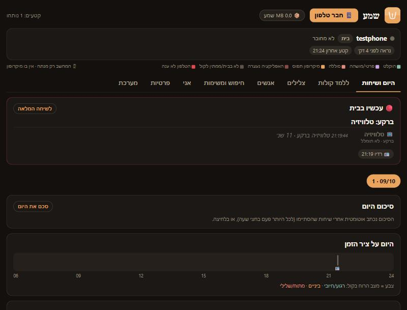

<div dir="rtl">

# שמע

**שמע** מקליט את מה שנאמר סביבך במשך היום, מתמלל אותו לעברית ומסדר אותו: מי דיבר, על מה, באיזה טון, ומה נשמע ברקע. אחר כך אפשר לחפש בשיחות ולשאול עליהן שאלות.

הכל קורה **אצלך**: אפליקציית אנדרואיד מקשיבה ושומרת רק קטעים שיש בהם דיבור, ושולחת אותם למחשב Windows שלך בבית. המחשב מתמלל ומנתח. אין שרת בענן, אין חשבון, ושום הקלטה לא יוצאת מהבית.



## מה הוא עושה

- **טלפון:** מקשיב ברקע. זיהוי דיבור (Silero VAD) רץ בטלפון עצמו, כך שרק דיבור נשמר. הקטעים נשלחים למחשב ברשת הביתית (או דרך Tailscale מבחוץ). כשהמחשב לא זמין הם מחכים בטלפון.
- **מחשב:** תמלול עברית ([ivrit.ai](https://huggingface.co/ivrit-ai)), זיהוי דוברים לפי קול (אתה מלמד אותו מי זה מי), טון ורגש מהקול, צלילים ברקע (צחוק, דלת, טלוויזיה...), חלוקה לשיחות, סיכום לכל שיחה וליום (מודל מקומי ב-Ollama), משימות שנאמרו, חיפוש ושאלות.
- **פרטיות מובנית:** כפתור "פרטי לשעה", אזורים פרטיים לפי מיקום, מילים ביומן שמשתיקות את ההקלטה, ומחיקה אוטומטית של שיחות בחוץ שאתה לא משתתף בהן.

## דרישות

- **מחשב Windows 10/11 (64 ביט)** שדלוק רוב היום, עם 15GB פנויים לפחות.
- **כרטיס מסך NVIDIA עם 8GB ומעלה: מומלץ מאוד.** בלי זה הכל עובד על המעבד, אבל התמלול איטי יותר ומתעדכן לאורך היום ולא מיד.
- **טלפון אנדרואיד 10 ומעלה** (64 ביט).
- הטלפון והמחשב באותה רשת Wi-Fi בבית.

## התקנה ב-4 צעדים

1. **הורדה:** בעמוד [Releases](../../releases/latest) מורידים את `shema-windows-vX.Y.Z.zip` ופותחים אותו (קליק ימני ← חלץ הכל).
2. **מחשב:** בתיקייה שנפתחה נכנסים ל-`install` ולוחצים פעמיים על **`Install.bat`**. המתקין בודק את המחשב, מתקין את מה שחסר (Python, ffmpeg, Ollama והמודלים, כמה GB בפעם הראשונה), שואל איך קוראים לך, ופותח את המסך של שמע. בסוף Windows ישאל פעם אחת אם לאשר שינוי: זה פותח את הפורט לטלפון, רק ברשת הביתית.
3. **טלפון:** במסך של שמע במחשב לוחצים **📱 חבר טלפון**. סורקים במצלמה של הטלפון את ה-QR הקטן כדי להוריד את האפליקציה, מתקינים (אם נשאל: מאשרים התקנה ממקור זה), פותחים, לוחצים **"חבר למחשב"** וסורקים את ה-QR הגדול. האפליקציה תבקש הרשאות (מיקרופון, התראות, סוללה ללא הגבלה, מיקום כדי לזהות את רשת הבית). כדאי לאשר הכל. רשימת "מה חסר" במסך הראשי מראה מה נשאר.
4. **לימוד קול:** באפליקציה לוחצים **"ללמד את הקול שלי"** וקוראים בקול 25 שניות. אחר כך, במחשב בלשונית **"ללמד קולות"**, עונים על כמה שאלות "מי זה?" על אנשים אחרים. אחרי 3 עד 5 דוגמאות לכל אדם, שמע מזהה אותו לבד.

את המסך פותחים מהסמל **"שמע"** בשולחן העבודה (`http://localhost:8770/home`). השרת עולה לבד בכל כניסה ל-Windows, ברקע ובלי חלון.

**שני תפקידים לטלפון** (באפליקציה ← הגדרות): **טלפון אישי** (ברירת המחדל) הולך איתך ומקליט גם בחוץ, אבל רק אחרי שלמד את הקול שלך, והמחשב שומר רק שיחות שאתה משתתף בהן. **טלפון בית** נשאר בבית ומקליט רק כשהוא ברשת הבית.

## הקלטה גם מחוץ לבית (Tailscale)

בלי הגדרה נוספת, מה שמוקלט בחוץ נשמר בטלפון ונשלח כשחוזרים הביתה. כדי שיישלח גם מבחוץ:

1. מתקינים [Tailscale](https://tailscale.com/download) (חינם) במחשב ובטלפון ומתחברים לאותו חשבון.
2. מריצים שוב את `Install.bat`. הוא מזהה את Tailscale, מוסיף כלל חומת אש רק לכתובות Tailscale ‏(100.64.0.0/10) ומכניס את הכתובת ל-QR.
3. בטלפון: "חבר למחשב" וסריקה מחדש.

התעבורה עוברת ישירות בין המכשירים שלך, מוצפנת.

## פתרון בעיות

**Smart App Control / "An Application Control policy has blocked this file"**
ב-Windows 11 חדשים פועלת לפעמים הגנה בשם Smart App Control, שחוסמת קבצים בלי חתימה מוכרת, כולל חלק מספריות Python. המתקין בודק את זה, **לא מכבה אותה**, ובסוף מדווח בדיוק מה נחסם. האפשרויות: להתקין את צד המחשב על מחשב אחר, או לכבות את Smart App Control בעצמך (אבטחת Windows ← בקרת אפליקציות ודפדפן). שים לב: אחרי כיבוי אי אפשר להפעיל אותה שוב בלי להתקין את Windows מחדש. ההחלטה שלך.

**Windows מזהיר כשפותחים את Install.bat**
קבצים שהורדו מהאינטרנט מסומנים. אפשר לבדוק את הקוד כאן בריפו, ואז "מידע נוסף" ← "הפעל בכל זאת", או קליק ימני על ה-ZIP לפני החילוץ ← מאפיינים ← "בטל חסימה".

**הטלפון הורג את האפליקציה ברקע (Xiaomi/MIUI/HyperOS, OPPO/realme/OnePlus/ColorOS, Samsung, vivo)**
ברשימת "מה חסר" באפליקציה יש כפתורים שפותחים את המסך הנכון:
- **סוללה:** ללא הגבלות.
- **הפעלה אוטומטית** (Xiaomi, ColorOS, vivo): להפעיל לשמע.
- **ColorOS:** "פעילות ברקע ללא הגבלה", ובמסך האפליקציות האחרונות לנעול את הכרטיס של שמע (מנעול).
- **MIUI/HyperOS:** "חיסכון בסוללה" ← ללא הגבלות, ו"הפעלה אוטומטית".
פס הכיסוי בכל כרטיס טלפון במסך המחשב מראה בדיוק מתי הטלפון לא הקליט, ולמה.

**הטלפון לא מתחבר**
- הטלפון והמחשב באותה רשת Wi-Fi? (לא רשת אורחים)
- ב-Windows הרשת מוגדרת "ציבורית"? המתקין מתריע על זה. צריך לשנות ל"פרטית": הגדרות ← רשת ואינטרנט ← Wi-Fi ← מאפיינים.
- המחשב דלוק והשרת רץ? פתח את הסמל "שמע" במחשב. אם המסך לא נפתח, הרץ שוב את `Install.bat`.
- המחשב קיבל כתובת חדשה מהראוטר? סרוק שוב את ה-QR.
- יומן השרת: `%LOCALAPPDATA%\Shema\data\listener.log`.

**התמלול איטי**
בלי NVIDIA (או עם פחות מ-8GB) התמלול רץ על המעבד, וזה צפוי. ההקלטות לא הולכות לאיבוד: הן מחכות בתור ומתומללות לפי הסדר. אפשר לראות את התור בלשונית "מערכת".

## פרטיות

- **הכל מקומי.** ההקלטות, התמלולים, הסיכומים וחתימות הקול נשמרים רק במחשב שלך, ב-`%LOCALAPPDATA%\Shema\data`. הסיכומים נכתבים על ידי מודל שרץ במחשב (Ollama). אין שרת של שמע, ושום דבר לא עולה לענן.
- **מה כן יוצא לאינטרנט:** רק הורדות, בזמן ההתקנה ובשימוש הראשון: התוכנות והמודלים (GitHub, Hugging Face, PyTorch, Ollama, winget). פעם ב-90 יום השרת בודק ב-Hugging Face אם יש מודל תמלול עברי חדש. זיהוי שירים (Shazam) **כבוי** כברירת מחדל. אם מפעילים אותו (`"song_lookup": true` ב-config.json), נשלחת חתימה אקוסטית של קטע מוזיקה, לא הקלטה.
- **הטלפון שולח רק למחשב שלך**, לכתובת שבקוד ה-QR. קוד הגישה נוצר אקראית בהתקנה. המסך במחשב פתוח רק למחשב עצמו ולמכשירים עם הקוד.
- **שמירת שמע:** כברירת מחדל נשמר ארכיון קטן (Opus ‏12kbps, בערך 5MB לשעת דיבור). שמע של צלילים ושל לימוד קול נמחק. אפשר למחוק הקלטות לפי תאריך מהמסך (📦).
- **מי שלא רוצה להיות מוקלט:** במסך "פרטיות" מסמנים אותו. כל מה שהוא אומר נמחק מיד, גם בעתיד.

## הקלטה וחוק

> זה לא ייעוץ משפטי.

בישראל, לפי **חוק האזנת סתר**, מי שמשתתף בשיחה רשאי בדרך כלל להקליט אותה. **הקלטה של שיחה שאתה לא צד לה** (למשל "טלפון בית" שמקליט כשאתה לא בבית, או שיחה של אחרים בחדר אחר) **עלולה להיות עבירה.**

לכן:
- **ספר לבני הבית** ולמי שמדבר איתך באופן קבוע שאתה משתמש בשמע. עדיף לקבל הסכמה.
- הטלפון האישי מתוכנן לשמור בחוץ רק שיחות שהקול שלך נשמע בהן. זה עוזר, אבל זה לא תחליף לשיקול דעת.
- במקומות רגישים (רופא, עבודה, מקומות של אחרים) השתמש ב"פרטי לשעה" או באזורים פרטיים.
- **האחריות על השימוש היא שלך בלבד.** בחו"ל החוק שונה, ובמקומות רבים נדרשת הסכמה של כל המשתתפים.

## עדכון

מורידים את ה-ZIP החדש מ-[Releases](../../releases/latest) ומריצים שוב את `Install.bat`. הנתונים, הקולות שלימדת וקוד הגישה נשארים. המתקין גם מוריד את האפליקציה העדכנית לטלפון, וכדי לעדכן את הטלפון פותחים בו שוב את הקישור מ"📱 חבר טלפון" (ההתקנה מעל הגרסה הקיימת שומרת את ההגדרות).

## הסרה

- **מחשב:** `%LOCALAPPDATA%\Shema\Uninstall.bat` (או `install\Uninstall.bat` מה-ZIP). מסיר את המשימה ברקע, את כללי חומת האש, את סביבת ה-Python, את המודלים ואת הקיצורים. **שואל לפני** שהוא מוחק את ההקלטות והנתונים. Python, ffmpeg, Ollama ו-Tailscale נשארים, ואפשר להסיר אותם בהגדרות ← אפליקציות.
- **טלפון:** לחיצה ארוכה על הסמל של שמע ← הסר התקנה. מה שעוד לא נשלח נמחק איתו.

## רכיבי צד שלישי

הקוד של שמע הוא תחת רישיון MIT (קובץ `LICENSE`). **המודלים לא נמצאים בריפו**: הם יורדים בזמן ההתקנה או בשימוש הראשון, וכל אחד נשאר תחת הרישיון שלו:

| רכיב | תפקיד | איפה | רישיון |
|---|---|---|---|
| [Silero VAD](https://github.com/snakers4/silero-vad) | זיהוי דיבור | בתוך ה-APK, ומורד למחשב | MIT |
| [ONNX Runtime](https://github.com/microsoft/onnxruntime) | הרצת Silero בטלפון | בתוך ה-APK | MIT |
| [ZXing Android Embedded](https://github.com/journeyapps/zxing-android-embedded) + ZXing | סריקת QR | בתוך ה-APK | Apache-2.0 |
| AndroidX Core | ספריית אנדרואיד | בתוך ה-APK | Apache-2.0 |
| [qrcode-generator](https://github.com/kazuhikoarase/qrcode-generator) | ציור ה-QR במסך | `server/ui/qrcode.js` | MIT |
| [ivrit-ai/whisper-large-v3-turbo-ct2](https://huggingface.co/ivrit-ai/whisper-large-v3-turbo-ct2) | תמלול עברית | מורד | Apache-2.0 |
| [faster-whisper](https://github.com/SYSTRAN/faster-whisper), CTranslate2 | הרצת התמלול | pip | MIT |
| [sherpa-onnx](https://github.com/k2-fsa/sherpa-onnx) | קולות וצלילים | pip | Apache-2.0 |
| [3D-Speaker ERes2NetV2](https://github.com/modelscope/3D-Speaker) | חתימת קול | מורד | Apache-2.0 |
| [NVIDIA TitaNet-Large](https://huggingface.co/nvidia/speakerverification_en_titanet_large) | חתימת קול | מורד | CC-BY-4.0 |
| [CED-base](https://huggingface.co/mispeech/ced-base) (גרסת sherpa-onnx) | זיהוי צלילים | מורד | Apache-2.0 |
| [emotion2vec+ large](https://huggingface.co/emotion2vec/emotion2vec_plus_large) | רגש מהקול | מורד | FunASR Model License 1.1 (שימוש חופשי בתנאי ייחוס) |
| [FunASR](https://github.com/modelscope/FunASR) | הרצת emotion2vec | pip | MIT |
| [audeering wav2vec2 MSP-dim](https://huggingface.co/audeering/wav2vec2-large-robust-12-ft-emotion-msp-dim) | עוררות וחיוביות בקול | מורד | **CC-BY-NC-SA-4.0: לשימוש לא מסחרי בלבד** |
| [LAION CLAP larger_clap_general](https://huggingface.co/laion/larger_clap_general) | צלילים שאתה מלמד (רק עם NVIDIA) | מורד | Apache-2.0 |
| [Demucs htdemucs](https://github.com/facebookresearch/demucs) | הפרדת דיבור ממוזיקה | pip + מורד | MIT |
| [Praat / parselmouth](https://github.com/YannickJadoul/Parselmouth) | גובה ועוצמת קול | pip | GPL-3.0 |
| PyTorch, transformers, librosa, huggingface_hub | תשתית | pip | BSD-3 / Apache-2.0 / ISC / Apache-2.0 |
| [Ollama](https://ollama.com) | הרצת מודל הסיכומים | winget | MIT |
| [Gemma 3](https://ai.google.dev/gemma/terms) (4b או 12b) | סיכומים | `ollama pull` | Gemma Terms of Use |
| [FFmpeg](https://ffmpeg.org) (build של Gyan) | המרת שמע | winget | GPL-3.0 |
| [shazamio](https://github.com/shazamio/ShazamIO) | זיהוי שירים, **אופציונלי וכבוי** | לא מותקן | MIT |

בגלל המודל של audeering, השימוש בשמע כמו שהוא מתאים **לשימוש אישי ולא מסחרי**.

## לפיתוח

```
android/   אפליקציית אנדרואיד (Kotlin, בלי קבצי layout). בנייה: android\gradlew.bat assembleRelease
server/    השרת (Python): home_listener.py (HTTP + תור + שיחות + סיכומים), home_analyze.py (תמלול, דוברים, טון),
           home_sounds.py (צלילים), voice_embed.py (חתימות קול), asr_update.py (בדיקת מודל חדש כל 90 יום), ui/home.html
install/   המתקין והמסיר ל-Windows
release.ps1  שחרור גרסה: .\release.ps1 1.0.1 "מה השתנה"
```

חתימת ה-APK: ה-keystore והסיסמאות שלו נמצאים **מחוץ לריפו**, ב-`~/.gradle/gradle.properties` (ראה `android/app/build.gradle.kts`). בלי אותו keystore אי אפשר לפרסם עדכון שיותקן מעל הגרסה הקיימת בטלפונים.

</div>
